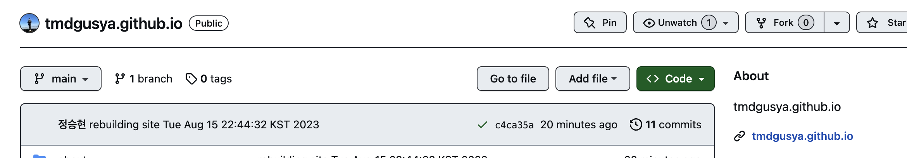
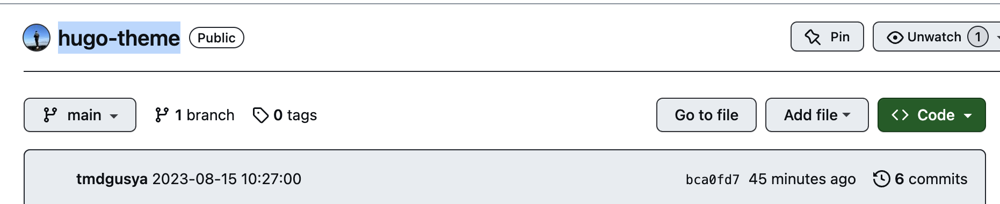
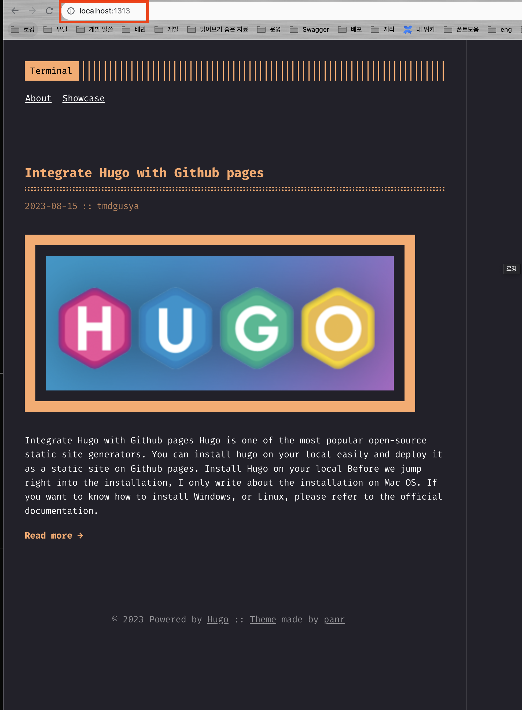
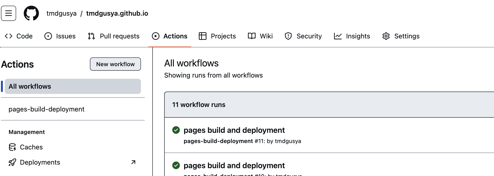
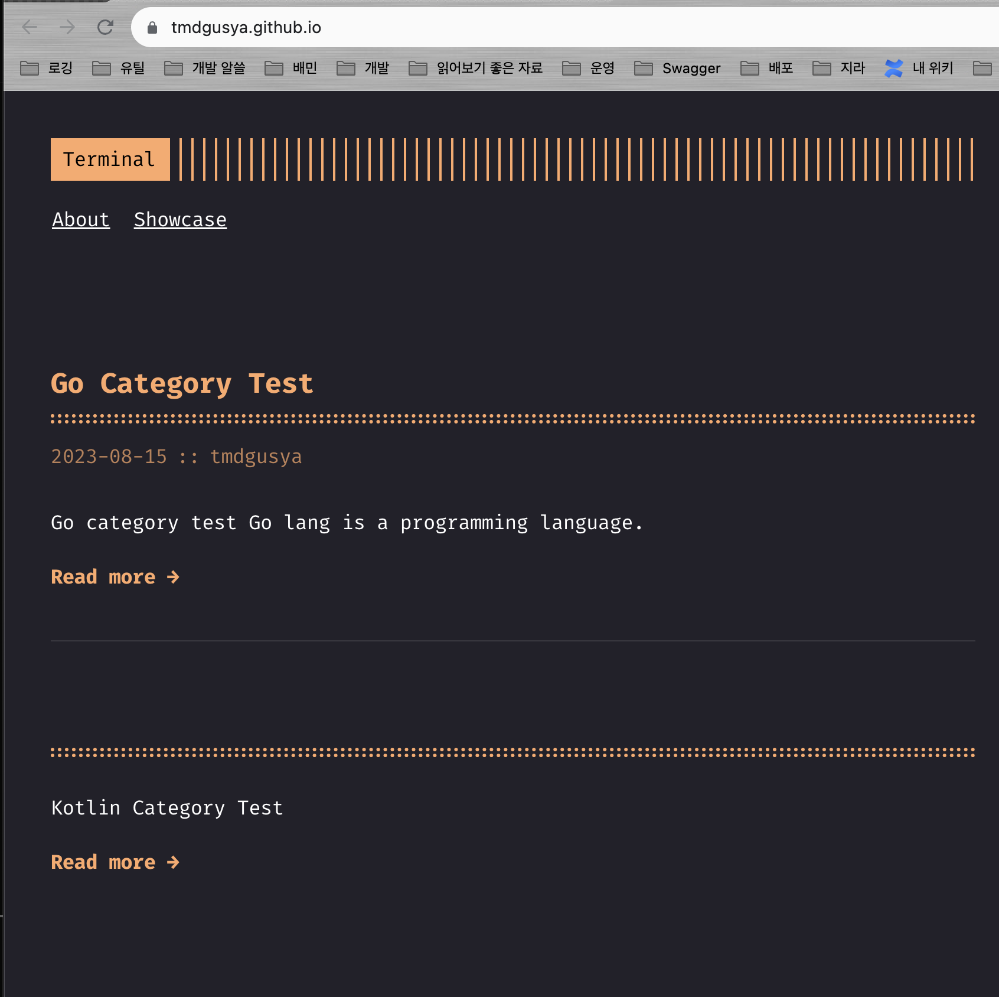

+++
title = "Make Personal Blog with Hugo and Github pages" 
date = "2023-08-15" 
author = "tmdgusya" 
cover= "posts/hugo/logo.png"
+++

# Integrate Hugo with Github pages

**[Hugo](https://gohugo.io/)** is one of the most popular open-source static site generators. 
You can install hugo on your local easily and deploy it as a static site on Github pages.

## Install Hugo on your local

Before we jump right into the installation, I only write about the installation on Mac OS. If you want to know how to install Windows, or Linux, please refer to the [official documentation](https://gohugo.io/getting-started/installing/).


```sh
brew install hugo
```

If you finished install `hugo`, move on to the next step.

## Make a deploy repository on Github

We need to make **two repositories** on Github. One is for the source code of the blog, and the other is for the static site. So, we need to use `submodule` to manage the two repositories.

One's name should be **'username.github.io'** for indicating that it is a Github pages repository. The other's name can be anything you want. Make repository like below.



The repository above is used to deploy the static site. So, You don't need to write anything in the repository.

## Make a blog repository on Github

This repository above is used to manage posts of the blog. So, you need to write post in this repository. I'll make a blog repository named **'hugo-theme'**. Anything is fine.



All right! We made two repositories. Let's move on to the next step.

## Make hugo blog directory

In this step we are going to **make a hugo blog directory**. Follow the steps below.

1. Move to directory where you want to make a blog directory.
2. Move to the directory you made and execute the following command.
    ```sh
    hugo new site <your blog name>
    # I made a directory named 'blog' and executed the command below.
    # hugo new site blog
    ```
3. Move to `blog` directory.
    ```sh
    cd blog
    ```
4. If you want to **apply theme**, execute the following command. In this tutorial, I'll use [hugo-theme-terminal](https://themes.gohugo.io/themes/hugo-theme-terminal/). If you want to use another theme, please refer to [this](https://themes.gohugo.io/). You can find easily how to apply theme on your hugo.
    ```sh
    git init
    git submodule add -f https://github.com/panr/hugo-theme-terminal.git themes/terminal
    ```
5. Copy configure file from web-site If you have to
    - If you want to use [hugo-theme-terminal](https://themes.gohugo.io/themes/hugo-theme-terminal/), you can copy configure file from [here](https://themes.gohugo.io/themes/hugo-theme-terminal/#how-to-configure).
6. Test it in local.
    ```sh
    # hugo server -t {theme_name} (You must be follow the rule which is written in the theme's README.md)
    hugo server -t terminal
    ```
7. Go to `http://localhost:1313` and check it.

    

## Connect blog repository as a submodule

Before we connect blog repository as a submodule, there is a one thing you have to know which is Build results of `hugo` are being packed in `public` directory. So, we need to connect blog repository as a submodule in `public` directory.

1. **Connect blog repository as a submodule.** (You have to replace the link below to your blog repository link)
    ```sh
    git submodule add -b main https://github.com/yours/yours.github.io.git public
    ```

2. Build hugo blog.
    ```sh
    hugo -t terminal
    ```

3. Move to `public` directory and push it.
    ```sh
    cd public
    git add .
    git commit -m "Initial commit"
    git push origin main
    ```

4. Go to your repository and check the `Actions` Menu. You can see the build result.

    

5. Go to your blog site! You can see the result.

    

## Make a shell for auto-deploy

If you want to deploy your blog automatically, you can use `shell` script. I'll show you how to make a shell script for auto-deploy.

```sh
#!/bin/bash

# 1. Build the project using hugo
hugo -t terminal

# 2. Go To Public folder
cd public

# 3. Add changes to git.
git add .

# 4. Commit changes.
msg="rebuilding site $(date)"

# 5. Push source and build repos.
git commit -m "$msg"
git push origin main

if [ $# -eq 1 ]
  then msg="$1"
fi
```

## Conclusion

In this tutorial, I showed you how to integrate hugo with Github pages. If you have any questions, please leave a comment below. Thank you for reading my post. Have a nice day!
